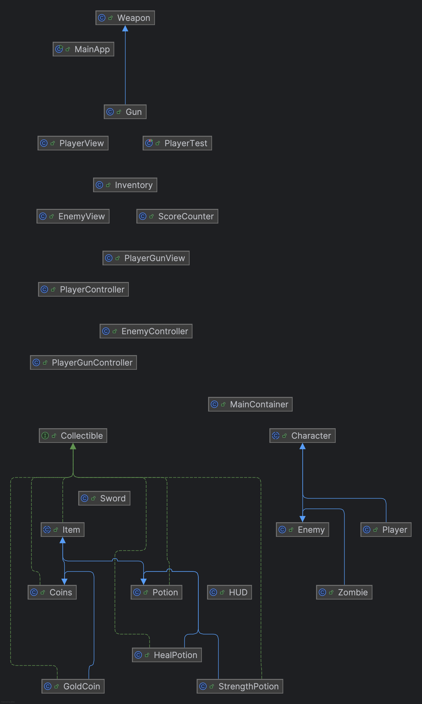

# Last Survivor - Game Documentation

## Table of Contents

1. [Project Overview](#project-overview)
2. [Game Features](#game-features)
3. [Installation & Setup](#installation--setup)
4. [How to Play](#how-to-play)
5. [Game Architecture](#game-architecture)
6. [Class Hierarchy](#class-hierarchy)
7. [OOP Principles Implementation](#oop-principles-implementation)
8. [Design Patterns](#design-patterns)
9. [Project Structure](#project-structure)
10. [Development](#development)
11. [Testing](#testing)

## Project Overview

**Last Survivor** is an action-packed survival game where players control a character navigating through waves of zombies. The primary objective is to survive as long as possible by defeating enemies, collecting coins to increase score, and utilizing various power-ups to enhance survival chances.

### Developer

**Sven Fischer**

### Project Type

Java-based 2D action game using Swing GUI framework

## Game Features

### Core Gameplay Mechanics

- **Smooth Movement**: WASD key controls for character movement
- **Combat System**:
  - Long-range shooting with mouse targeting
  - Close-combat sword attacks with spacebar
- **Item Collection**:
  - Healing potions (key 1) - restores health
  - Strength potions (key 2) - temporarily increases damage for 5 seconds
  - Coins (gold and silver) for scoring
- **Score System**: Based on coin collection from defeated enemies
- **Inventory Management**: Simple potion tracking and health display
- **Wave System**: Progressive difficulty with increasing enemy counts

### Enemy Types

- **Basic Enemies**: Standard enemies with 4 health, 1 damage, and 100 speed
- **Big Zombies**: High health (10 HP) and damage (4), but slow movement (50 speed)
- **Fast Zombies**: Low health (2 HP) but very fast movement (150 speed) and moderate damage (2)

### Visual Elements

- Real-time HUD updates
- Character sprite animations
- Enemy AI with pursuit behavior
- Collision detection system

## Installation & Setup

### Prerequisites

- Java 21 or higher
- Maven 3.6 or higher

### Building the Project

```bash
# Clone the repository
git clone https://github.com/SvenFischer282/TheLastSurvivor.git
cd TheLastSurvivor

# Compile the project
mvn clean compile

# Run the game
mvn exec:java -Dexec.mainClass="Main.GUI.MainApp"
```

### Alternative Execution

```bash
# Build JAR file
mvn clean package

# Run the JAR
java -jar target/Last_Survivor-1.0-SNAPSHOT.jar
```

## How to Play

### Controls

- **W, A, S, D**: Move character (up, left, down, right)
- **Mouse**: Aim and shoot projectiles
- **Spacebar**: Sword attack (close combat)
- **1**: Use healing potion
- **2** (or **Numpad 2**): Use strength potion

### Gameplay Tips

1. **Movement**: Keep moving to avoid zombie swarms
2. **Combat**: Use ranged attacks for safety, melee for close encounters
3. **Resources**: Collect coins to increase score and potions for survival
4. **Strategy**: Manage your inventory wisely - save potions for critical moments

## Game Architecture

The game follows a modular architecture with clear separation of concerns:

### Core Components

- **Game Logic**: Character behavior, combat mechanics, scoring
- **GUI Layer**: User interface, rendering, input handling
- **Utilities**: Helper classes for serialization, random generation, exceptions

### Key Systems

- **Character System**: Player and enemy management
- **Inventory System**: Item collection and usage
- **Collision System**: Detection and response
- **Scoring System**: Point calculation and tracking

## Class Hierarchy



### Character Hierarchy

```
Character (Abstract)
├── Player
└── Enemy
    └── Zombie
        ├── BigZombie
        └── FastZombie
```

### Item Hierarchy

```
Item (Abstract)
└── Collectible (Interface)
    ├── Potion (Abstract)
    │   ├── HealPotion
    │   └── StrengthPotion
    └── Coins (Abstract)
        ├── GoldCoin
        └── SilverCoin
```

### Weapon Hierarchy

```
Weapon (Abstract)
├── Gun
└── Sword
```

## OOP Principles Implementation

### 1. Inheritance

- **Character Hierarchy**: `Character` → `Player` and `Enemy`
- **Item Hierarchy**: `Item` → `Collectible` → `Potion`/`Coins`
- **Weapon Hierarchy**: `Weapon` → `Gun`/`Sword`

### 2. Encapsulation

- Private fields with public getters/setters
- Protected access for inheritance
- Controlled access through methods
- Example: `private int health` with `getHealth()` and `setHealth()`

### 3. Polymorphism

- Method overriding in subclasses
- Runtime method dispatch
- Interface implementations with different behaviors
- Example: `Potion.use()` behaves differently for `HealPotion` vs `StrengthPotion`

### 4. Abstraction

- Abstract classes: `Character`, `Item`, `Weapon`
- Interfaces: `Collectible`, `GameStateObserver`
- Common behavior definition with specific implementations

## Design Patterns

### Factory Pattern

- **EnemyFactory**: Creates different enemy types
- **PotionFactory**: Generates various potion types
- **CoinFactory**: Produces different coin types

### Observer Pattern

- **GameStateObserver**: Notifies UI components of state changes
- **GameStateSubject**: Manages observer subscriptions

### Singleton Pattern

- **ScoreCounter**: Global access to game scoring system

### Strategy Pattern

- **Collision Handlers**: Different collision strategies for different item types

## Project Structure

```
src/
├── Main/                       # Main package (not src/Main)
│   ├── Game/                   # Core game logic
│   │   ├── Character/          # Player and enemy classes
│   │   ├── Collectible/        # Items and collectibles
│   │   ├── Weapons/            # Weapon implementations
│   │   ├── Inventory.java      # Inventory management
│   │   └── ScoreCounter.java   # Scoring system
│   ├── GUI/                    # User interface
│   │   ├── MainApp.java        # Main application entry point
│   │   ├── HUD.java            # Heads-up display
│   │   ├── Player/             # Player GUI components
│   │   ├── Enemy/              # Enemy GUI components
│   │   ├── Coins/              # Coin display
│   │   └── Potions/            # Potion display
│   ├── Resources/              # Game assets
│   │   └── Images/             # Sprite images
│   └── Utils/                  # Utility classes
│       ├── Exceptions/         # Custom exceptions
│       ├── Observer/           # Observer pattern implementation
│       ├── RandomBorderCoordinates.java
│       └── SerializationUtils.java
└── test/                       # Unit tests
```

## Development

### Code Quality

- Comprehensive unit test coverage
- Logging with Log4j2
- Exception handling with custom exceptions
- Clean code principles

### Build System

- Maven for dependency management
- Automated compilation and packaging
- Test execution integration

### Dependencies

- Java 21
- Log4j2 for logging
- JUnit for testing

## Testing

The project includes comprehensive unit tests covering:

- **Character Tests**: Player and enemy behavior
- **Item Tests**: Collectible functionality
- **Factory Tests**: Object creation patterns
- **Utility Tests**: Helper class functionality
- **Exception Tests**: Error handling

### Running Tests

```bash
# Run all tests
mvn test

# Run specific test class
mvn test -Dtest=PlayerTest

# Generate test reports
mvn surefire-report:report
```

### Test Coverage

- Core game mechanics: ✅
- Character interactions: ✅
- Item collection: ✅
- Factory patterns: ✅
- Exception handling: ✅

## Future Enhancements

### Potential Improvements

- **Additional Enemy Types**: More variety in enemy behaviors
- **Power-ups**: Temporary abilities and enhancements
- **Level System**: Progressive difficulty and unlockable content
- **Sound Effects**: Audio feedback for actions
- **Save System**: Game state persistence
- **Multiplayer**: Cooperative or competitive modes

### Technical Improvements

- **Performance Optimization**: Rendering and collision detection
- **Code Refactoring**: Further modularization
- **Documentation**: API documentation with JavaDoc
- **CI/CD**: Automated testing and deployment

## Conclusion

The Last Survivor project successfully demonstrates:

- **Modular Design**: Clear separation of concerns
- **Maintainable Code**: Easy to understand and modify
- **Extensible System**: Simple addition of new features
- **OOP Best Practices**: Proper implementation of core principles
- **Comprehensive Testing**: Reliable and robust codebase

The game provides an engaging survival experience while showcasing solid software engineering practices and object-oriented design principles.
